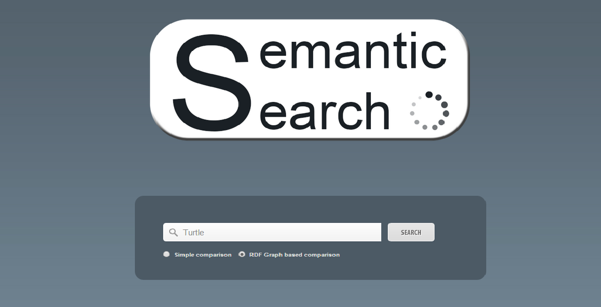

Semantic Search Engine
======================

Launch
------

* [Install Play](https://www.playframework.com/download)
* `cd java_server`
* `activator run`
* `localhost:9000`

Features
--------

* Semantic autocomplete based on DBPedia's [Prefix Search API](http://wiki.dbpedia.org/Lookup) that peforms a keyword to concept mapping to disambiguate the sens.
* Results ranking based on a simple comparison between the  DBpedia resources found the website and the resources associated to the keyword.
* Results ranking based on extending the resources found in each website and creating the associated RDF graph, then we compare it to the RDF graph associated with the keyword. This way we take the the links between resources into considerations.
* For each website, we provide a list of similar websites based on their RDF graphs.

